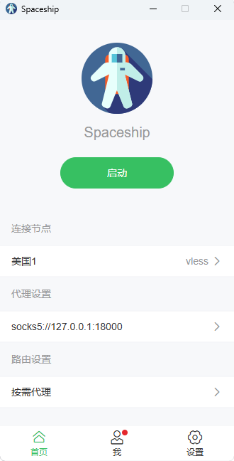

# Spaceship

A GUI client built on top of [jets](https://github.com/zhangsan946/jets) and [tauri](https://tauri.app/) provides with unified user experience across all the modern platforms: Windows, Linux, MacOS, Android, and iOS.

It currently contains two type of releases:

1. Normal releases: It just has [xray-core](https://github.com/XTLS/Xray-core/releases) and tun2socks embedded. But it won't support `iOS` due to very [limited memory budget](https://groups.google.com/g/traffic-obf/c/PksmyfHMUb4?pli=1) for network extensions.

2. Beta releases: It use [jets](https://github.com/zhangsan946/jets) as the core which is built with pure Rust for lower memory cunsumption and better efficiency. It would support **all the platforms**. But it only has part of the existing features implemented. For the progress, please refer to the jets' [README.md](https://github.com/zhangsan946/jets/blob/main/README.md).
### Some Screenshots

